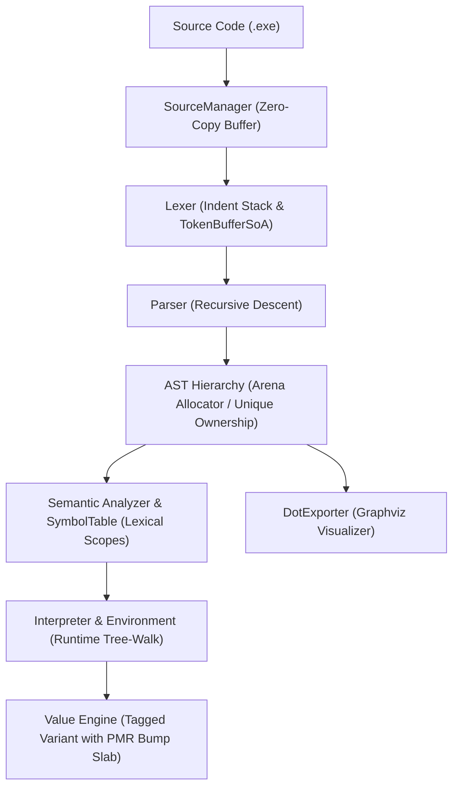

# Execore Language Engine Documentation

Execore is an ISO C++23 programming language implementation featuring off-side indentation, dynamic typing with optional type annotations, and a high-throughput runtime. The project follows the Pitchfork directory structure and conforms to the Frontier C++ Engineering Standard.

---

## 1. System Pipeline

Execore compiles and executes source scripts (`.exe`) through a single-pass frontend and AST interpreter:



---

## 2. Core Subsystems

### Frontend Pipeline
* **`SourceManager`** ([`include/execore/frontend/source_manager.hpp`](file:///home/execorn/programming/mipt_course/Execore_Language/include/execore/frontend/source_manager.hpp)): Loads source files once into contiguous memory buffers, tracks file lifetimes, and calculates line and column numbers using binary search over line break offsets.
* **`Lexer` and `TokenBufferSoA`** ([`include/execore/frontend/token_soa.hpp`](file:///home/execorn/programming/mipt_course/Execore_Language/include/execore/frontend/token_soa.hpp)): Synthesizes `INDENT` and `DEDENT` tokens to enforce Python-style indentation rules. Provides both contiguous Structure-of-Arrays (SoA) layout for vectorized scanning (>100 MiB/s) and classic token iterators.
* **`Parser`** ([`include/execore/frontend/parser.hpp`](file:///home/execorn/programming/mipt_course/Execore_Language/include/execore/frontend/parser.hpp)): Precedence-climbing recursive descent parser with error recovery synchronization. Supports both direct AST generation and C++23 `std::expected` monadic returns (`Result<std::unique_ptr<Program>, ParseError>`).

### Memory and Runtime Architecture
* **Monadic Error Handling** ([`include/execore/common/result.hpp`](file:///home/execorn/programming/mipt_course/Execore_Language/include/execore/common/result.hpp)): Implements railway-oriented monadic combinators (`and_then`, `transform`, `or_else`) on top of C++23 `std::expected`.
* **Arena Allocation and PMR** ([`include/execore/common/pmr_resource.hpp`](file:///home/execorn/programming/mipt_course/Execore_Language/include/execore/common/pmr_resource.hpp)): `MonotonicArenaResource` derives from `std::pmr::memory_resource` for zero-overhead bump allocation during parsing and evaluation. AST nodes are freed in reverse allocation order to safely destruct nested structures.
* **Environment and Cycle Breaking** ([`include/execore/runtime/environment.hpp`](file:///home/execorn/programming/mipt_course/Execore_Language/include/execore/runtime/environment.hpp)): Lexical scopes are modeled as chained activation records. Closures capture environments through `std::shared_ptr`. A weak registry tracks all active environments, and `Interpreter::~Interpreter()` clears bindings on exit to break reference cycles and guarantee zero leaks under AddressSanitizer.
* **Cacheline Interference Protection**: `ThreadExecutionContext` aligns hot per-thread runtime state to `hardware_destructive_interference_size` (64 bytes) to avoid false sharing in concurrent environments.

---

## 3. Specifications and Design Records

* [Formal Grammar (EBNF)](file:///home/execorn/programming/mipt_course/Execore_Language/docs/grammar.md): Complete grammar rules, operator precedence table, and lexical specifications.
* [System Architecture](file:///home/execorn/programming/mipt_course/Execore_Language/docs/architecture.md): Deep-dive into memory layouts, data flow, and error propagation paths.
* [Verification Scorecard](file:///home/execorn/programming/mipt_course/Execore_Language/docs/audit_scorecard.md): Milestone audit scores and verification criteria.

### Architecture Decision Records (ADRs)
* [ADR 0001: Pitchfork Layout and CMakePresets v8 Migration](file:///home/execorn/programming/mipt_course/Execore_Language/docs/adr/0001-pitchfork-layout-and-cmake-presets.md)
* [ADR 0002: C++23 Monadic Error Handling via std::expected](file:///home/execorn/programming/mipt_course/Execore_Language/docs/adr/0002-cxx23-monadic-error-handling.md)
* [ADR 0003: Arena Bump Allocator and Polymorphic Memory Resources (PMR)](file:///home/execorn/programming/mipt_course/Execore_Language/docs/adr/0003-arena-bump-allocator-and-pmr.md)
* [ADR 0004: Data-Oriented Design (DoD) via Token Structure of Arrays (SoA)](file:///home/execorn/programming/mipt_course/Execore_Language/docs/adr/0004-data-oriented-design-token-soa.md)
* [ADR 0005: 5-Tier Verification Matrix, Property-Based Testing, and Continuous Fuzzing](file:///home/execorn/programming/mipt_course/Execore_Language/docs/adr/0005-5-tier-verification-and-fuzzing.md)

---

## 4. Build Profiles and Optimization

Execore provides a reproducible build matrix managed by `CMakePresets.json`:

```bash
# Configure and run debug build with clang
cmake --preset dev-clang
cmake --build --preset dev
ctest --preset test-all

# Run sanitized test matrix
cmake --preset asan-ubsan
cmake --build --preset asan-ubsan
ctest --preset test-all

# Build with ThreadSanitizer
cmake --preset tsan
cmake --build --preset tsan
ctest --preset test-all
```

For maximum performance, run the automated Profile-Guided Optimization pipeline:

```bash
./tools/scripts/pgo_build.sh
```

The script compiles an instrumented binary, profiles it against benchmark workloads and example programs, merges profile data via `llvm-profdata`, and links the release binary with `-fprofile-instr-use` and ThinLTO.

---

## 5. Binary Hardening and Security Governance

Production builds incorporate defense-in-depth flags defined in [`cmake/Hardening.cmake`](file:///home/execorn/programming/mipt_course/Execore_Language/cmake/Hardening.cmake):
* `-D_FORTIFY_SOURCE=3`: Runtime and compile-time bounds checking for standard library buffer operations.
* `-fstack-protector-strong`: Canary guards on functions with stack buffers.
* `-Wl,-z,relro -Wl,-z,now`: Full RELRO makes the Global Offset Table read-only before execution begins.
* `-Wl,-z,noexecstack`: Marks binary segments non-executable to prevent stack execution attacks.
* `-fcf-protection=full`: Hardware-enforced branch target identification and shadow stack validation.

A CycloneDX v1.5 Software Bill of Materials is tracked in [`packaging/sbom.cyclonedx.json`](file:///home/execorn/programming/mipt_course/Execore_Language/packaging/sbom.cyclonedx.json).
